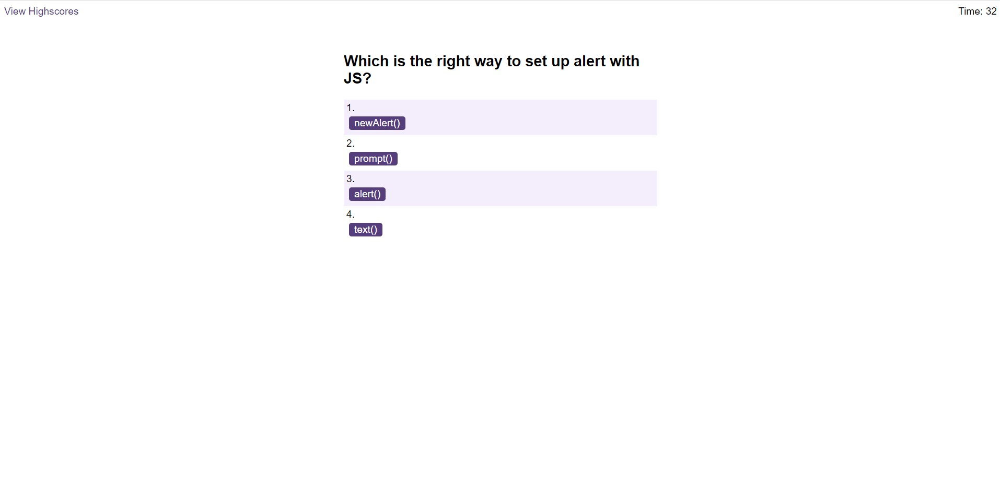

# Code-Quiz

## Description

This project about a coding quiz. When 'Start Quiz' button is clicked the timer starting countdown. The user can choose one answer and if the answer is correct will add 10 points if the answer is wrong 10 second will be taken from the time left. When the quiz finishes, the user can add initials and the score to the list with high scores.

## Screenshots
 

## Links

- Solution URL: [Solution URL here](https://github.com/KodeIva/Code-Quiz)
- Live Site URL: [Live site URL here](https://kodeiva.github.io/Code-Quiz/)

## Technologies used

- HTML5
- CSS 
- JavaScript

### JavaScript codes

- setInterval()
- addEventListener()
- createElement()
- appendChild()
- setAttribute()
- localStorage

## Installation

 N/A

## Credits

N/A

## License
[MIT](https://choosealicense.com/licenses/mit/)
